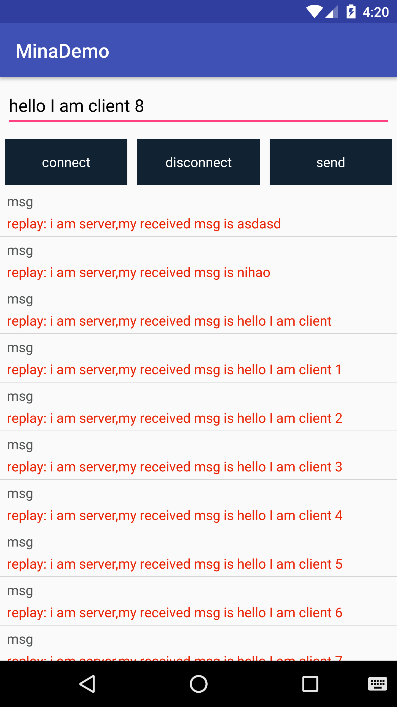

# MinaDemo
mina android client  server

## 连接参数设置
···
   MinaConfig.Builder builder = new MinaConfig.Builder()
                .setIp(Constant.MINA_HOST)
                .setConnectionTimeout(10000)
                .setReadBuilder(10240)
                .setPort(Constant.MINA_PORT)
                .setConnectLisenter(new ConnectLisenter() {
                    @Override
                    public void connFail() {
                        Log.e("mina", "server connect fail");
                        //Toast.makeText(MainActivity.this, "server connect fail", Toast.LENGTH_SHORT).show();
                    }

                    @Override
                    public void connSucc() {
                        Log.e("mina", "server connect succ");
                        //Toast.makeText(MainActivity.this, "server connect succ", Toast.LENGTH_SHORT).show();
                    }

                    @Override
                    public void connDis() {
                        Log.e("mina", "server connect disconnect");
                        //Toast.makeText(MainActivity.this, "server connect disconnect", Toast.LENGTH_SHORT).show();
                    }
                });

        MinaClientManager.getManagerInstance().initConfig(builder.builder());
        MinaClientManager.getManagerInstance().connect();

···
## 接收发送消息
发送消息
···
 public synchronized void send(String msg) {
        if (mIsConnect && mSession != null && mSession.isConnected()) {
            mSession.write(msg);
        } else {
            EventBus.getDefault().post(new MinaReciveFailEvent("send msg fail。server may be not connected... "));
        }
    }
···
接收消息在
···

    @Override
    public void messageReceived(IoSession session, Object message) throws Exception {
        String str = (String)message;
        Log.e(TAG, "前台收到消息如下：" + message);
        RecordBean recordBean= GsonUtil.fromJson(str, RecordBean.class);
        EventBus.getDefault().post(recordBean);
    }

···

